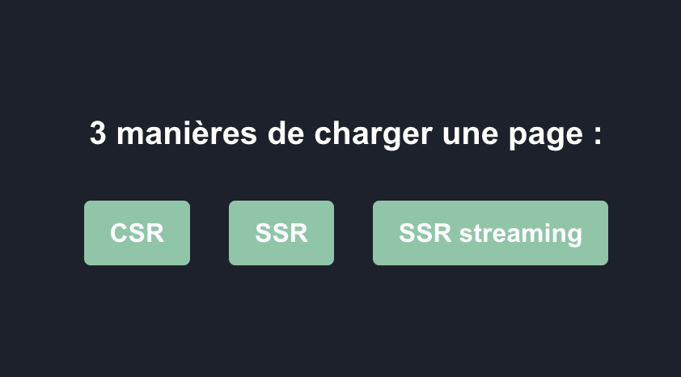

This project allows to compare three ways to show a page



## CSR : Client Side Rendering
Page is shown, and then data is fetched.
A loader is shown during data loading.


## SSR : Server Side Rendering
Data is fetched, before the page is shown.
But when the page appears, all data are visible.


## SSR Streaming : Combine SSR and CSR
Data is fetched, but server tells to client that data are coming.
During this time, client can show a loader.

## Getting Started

First, run the development server:

```bash
npm run dev
# or
yarn dev
# or
pnpm dev
# or
bun dev
```

Open [http://localhost:3000](http://localhost:3000) with your browser to see the result.
